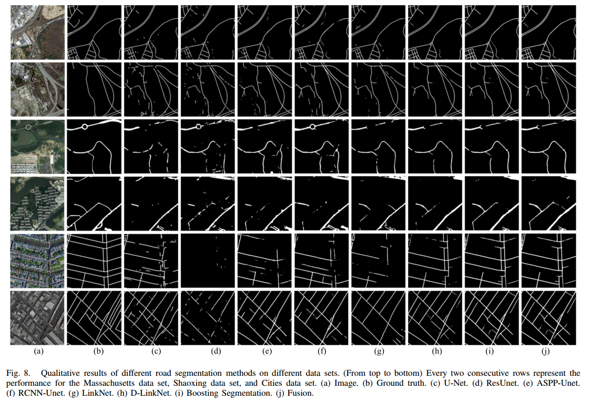
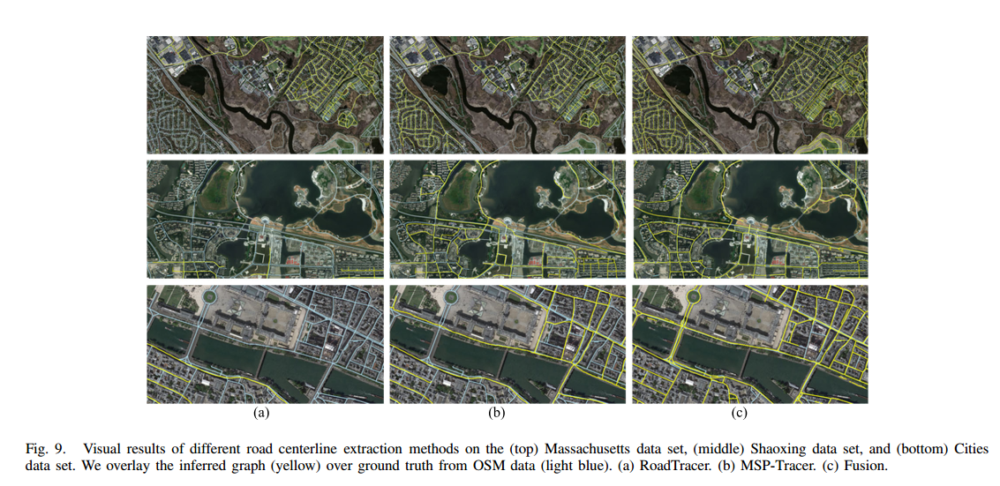

# Road-Extraction

A novel CNN-based multistage framework is proposed for simultaneous road surface and centerline tracing from remote sensing images instead of treating them separately as most current road extraction methods do.

This repository is the official implementation of [Simultaneous Road Surface and Centerline Extraction From Large-Scale Remote Sensing Images Using CNN-Based Segmentation and Tracing](https://ieeexplore.ieee.org/document/9094008). 

## Overview

Our framework consists of three steps: boosting segmentation, multiple starting points tracing,
and fusion. 

- The initial road surface segmentation is achieved with a fully convolutional network (FCN), after which another lighter FCN is applied several times to boost the accuracy and connectivity of the initial segmentation. 
- In the multiple starting points tracing step, the starting points are automatically generated by extracting the road intersections of the segmentation results, which then are utilized to track consecutive and complete road networks through an iterative search strategy embedded in a
  convolutional neural network (CNN). 
- The fusion step aggregates the semantic and topological information of road networks by
  combining the segmentation and tracing results to produce the final and refined road segmentation and centerline maps.  

## Pipeline


## Results








## Dependencies
```bash
Python == 3.6.7
PyTorch == 1.1.0
OpenCV == 4.1.0
Tensorflow-gpu == 1.8.0
Rtree == 0.8.3
Numpy == 1.16.3
```


## Usage

**1. Download dataset and prepare for the code**

If your road ground-truth is only in segmentation format, then you may have to first convert it to graph format (through `mapextract.py`) for centerline tracing process.

 **2. Boosting segmentation**

The initial road surface segmentation is achieved with D-LinkNet (CVPR_2018), you can refer to the original implementation or our reimplementation (in the folder initial_seg and run `road.py`). 

Regarding the designed Boosting Segmentation Network (BSNet), run `BSNet/cmd.py `to train and test multiple BSNets. 

The corresponding voting weight and training set for each BSNet are listed in the folder BSNet/boost_train.

**3. MSP-Tracer**

First, run `corner_detect.py ` to generate the starting points from the segmentation results. 

Then, train CNN by using `Tracer/train.py`, or you can refer to the original implementation of RoadTracer (CVPR_2018). For inference, run `Tracer/infer_MSPTracer.py` and `Tracer/infer_MSPTracer_postprocess.py`.

**4. Fusion**

Run `fusion.py` to produce the final and refined road segmentation and centerline maps.

**5. Evaluation road connectivity (Conn)**

Run `evaluate_connectivity.py`

Modify the parameters before running. 


## Pretrain Model

- baseline segmentation model, pretrained in massachusetts dataset. [Google drive](https://drive.google.com/file/d/1GNnGG-CEKf44LrEcPNXxOf0OJ9wAL7ZI/view?usp=sharing)


## Contributing

- [yao WEI](https://github.com/weiyao1996)
- [kai ZHANG](https://github.com/kai-zhang-er)


## Citation

If you find our work useful in your research, please cite:

```latex
@ARTICLE{9094008,
  author={Wei, Yao and Zhang, Kai and Ji, Shunping},
  journal={IEEE Transactions on Geoscience and Remote Sensing}, 
  title={Simultaneous Road Surface and Centerline Extraction From Large-Scale Remote Sensing Images Using CNN-Based Segmentation and Tracing}, 
  year={2020},
  volume={58},
  number={12},
  pages={8919-8931},
  doi={10.1109/TGRS.2020.2991733}}
```
