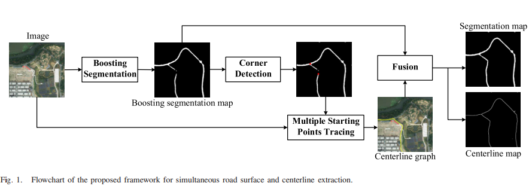
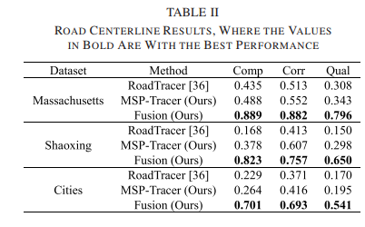
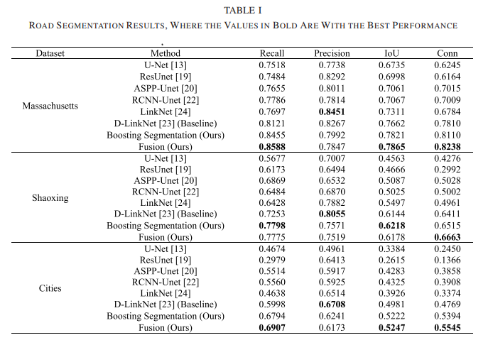

# Road-Extraction
This repository is the official implementation of [Simultaneous Road Surface and Centerline Extraction From Large-Scale Remote Sensing Images Using CNN-Based Segmentation and Tracing](https://ieeexplore.ieee.org/document/9094008). 

Our framework consists of three steps: boosting segmentation, multiple starting points tracing,
and fusion. 

- The initial road surface segmentation is achieved with a fully convolutional network (FCN), after which another lighter FCN is applied several times to boost the accuracy and connectivity of the initial segmentation. 
- In the multiple starting points tracing step, the starting points are automatically generated by extracting the road intersections of the segmentation results, which then are utilized to track consecutive and complete road networks through an iterative search strategy embedded in a
  convolutional neural network (CNN). 
- The fusion step aggregates the semantic and topological information of road networks by
  combining the segmentation and tracing results to produce the final and refined road segmentation and centerline maps.  

## Pipeline



## Results

### Road centerline results



### Road surface results



## Pretrain Model

- base segmentation model, pre-tained in massachusetts dataset. [Google drive](https://drive.google.com/file/d/1dbuln9hERFOKAwy7stG4M7dBdzZaKDbW/view?usp=sharing)

## Code Introduction

- **evaluate_connectivity.py**: evaluate the connectivity of final segmentation result.
- **base_segmentation/road.py**: train or test the model. Modify the parameters before running.

## Contributing

- [yao WEI](https://github.com/weiyao1996)
- [kai ZHANG](https://github.com/SummerOf15)


## Citation

If you find our work useful in your research, please cite:

```
@ARTICLE{9094008,  
author={Y. {Wei} and K. {Zhang} and S. {Ji}},  
journal={IEEE Transactions on Geoscience and Remote Sensing},   
title={Simultaneous Road Surface and Centerline Extraction From Large-Scale Remote Sensing Images Using CNN-Based Segmentation and Tracing},  
year={2020},  
pages={1-13},}
```

## Important! We are still cleaning up the source code. The code in this repo is incomplete.
